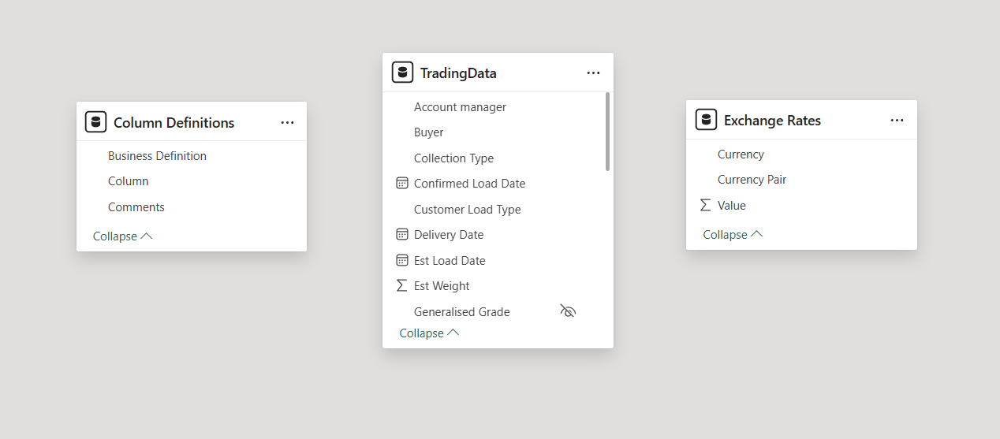
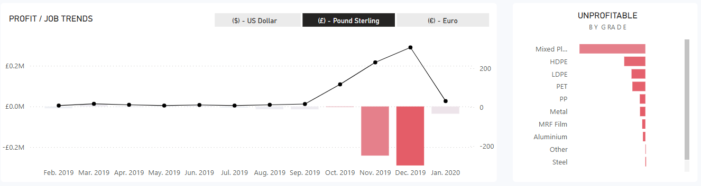
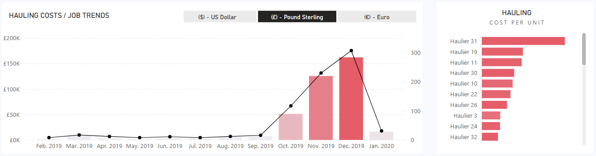
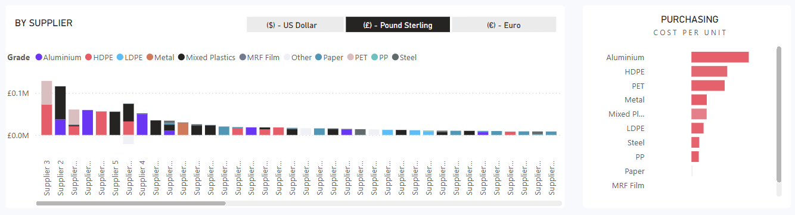
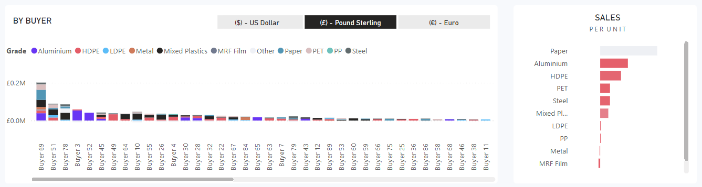

# EDR Sales and Cost Analysis

## Project Background
EDR is a company who look to buy and help remove scrap and waste recyclables from clients and then sell these to other providers. For certain items they incur a cost and for others they are actually paid to take away the materials. Some materials are received by buyers who they pay to take the materials away. EDR work with clients around the globe and are therefore purchasing, selling and hauling in different currencies.

## Excutive Summary
An analysis of 782 jobs from 2019 to 2022 reveals total sales of £9.43 million, with purchase costs of £11.63 million and hauling costs of £393,792, resulting in a net loss of £613,520. The company transported 16,400 units, averaging £503 per job and £24 per unit in hauling costs. Aluminium, HDPE, and PET contributed to 60% of total revenue, while Mixed Plastics, LDPE, and MRF Film were the most unprofitable materials. The average cost per job, including purchase and hauling, stood at £14,870, highlighting the need for cost optimization. To improve profitability, the company should focus on expanding high-margin materials, renegotiating supplier contracts, and optimizing logistics to reduce expenses.

#### Data Model Overview
- **TradingData** - This table holds the key information of all the transactions of the company for the year 2019 and 2020.  
- **ColumnDefinitions** - Short description for all the columns in the TradingData table.
- **ExchangeRates** - Stores exchange rates for the currencies used in the company's transactions.

## Insights Deep-Dive
### Profit Trends

- The company made a total profit of -£613.52K, indicating an overall loss. Mixed Plastics, HDPE, and LDPE were identified as the largest contributors to losses.
- The profitability remained flat for most of 2019 but saw an increase from September to November 2019 before a sharp decline in December 2019, indicating a sudden financial downturn. This suggests seasonal demand variations or operational inefficiencies that need to be analyzed further.
- The company is experiencing consistent losses every month, with profits ranging from -£2,800 to -£290,126.
- There isn't a direct correlation between job count and profit—some months with higher jobs still resulted in higher losses. December 2019 recorded the highest loss of £290,126, despite completing 307 jobs, the highest for any month.

### Hauling Costs

-  The company incurred a total hauling cost of £393,792 over 782 jobs within a year, transporting 16,400 units. This equates to an average cost of £503 per job and £24 per unit.
-  Different hauliers charge varying rates for similar jobs. Some hauliers are associated with negative profits, indicating high transportation costs reducing margins.
-  The hauling cost remained relatively stable for most of the year but showed spikes in November and December 2019, potentially due to increased demand or supplier rate changes. In these months, the profit trend turned negative, suggesting that higher hauling costs contributed to overall losses.
-  Hauling costs accounted for 4.2% of total sales revenue. When comparing with the total loss, hauling costs make up 64% of the net loss (£393,792 ÷ £613,520 × 100), indicating that optimizing these costs could significantly improve profitability.

### Purchase Costs

- The company incurred a total purchase cost of £11,62,732 over 782 jobs throughout the year. This translates to an average purchase cost of £1,487 per job.With a total of 16,400 units purchased, the average purchase cost per unit stands at £71.
- The top suppliers contributed significantly to the purchase costs, with Supplier 3 and Supplier 2 being the highest contributors, each surpassing £0.1M. The top 5 suppliers account for a large portion of the overall purchase expenditure, suggesting that optimizing these supplier contracts could yield cost savings.
- Mixed plastics, metal, aluminium, and HDPE dominate the higher-cost purchases.
- The high purchase costs, particularly from premium materials like Aluminium and HDPE, combined with substantial hauling expenses, have resulted in an overall net loss of £613.52K. The company could explore opportunities for bulk discounts, alternative suppliers, or cost-effective material substitutions to improve profitability.

### Sales

- The company generated total sales revenue of £9,43,001 across 782 jobs, leading to an average revenue of £1,206 per job. A total of 16,400 units were sold, bringing the average sales price per unit to £57. Despite significant sales, the company is operating at a net loss of £613.52K, primarily due to high purchase and hauling costs.
- Buyer 69, Buyer 51, and Buyer 3 were the top purchasers, with Buyer 69 alone contributing sales of over £0.2M. The top 10 buyers account for a large proportion of sales revenue, indicating a concentrated customer base. A long tail of buyers contributes relatively smaller amounts, suggesting potential opportunities to either expand relationships with high-value buyers or optimize smaller transactions.
- Paper commands the highest sales price per unit, followed by Aluminium and HDPE. PET, Steel, and Mixed Plastics also generate reasonable revenues but at a lower per-unit price. MRF Film and PP contribute the least to revenue per unit, indicating potential challenges in pricing or demand.
- Though Paper, Aluminium, and HDPE sell at higher prices, the profit margins are still be low due to high purchase costs.

## Recommendations
- The high purchase costs, combined with hauling expenses, resulted in an overall net loss of £613.52K. Managing purchase costs by negotiating better supplier rates or optimizing procurement strategies could improve profit margins.
- Hauling costs play a major role in profitability, accounting for 64% of total losses. Optimizing routes, selecting efficient hauliers, and consolidating shipments could save over £100,000 annually.
- Strategic changes such as route optimization, negotiating better rates with hauliers, or focusing on more profitable materials could improve profitability.
- Expand sales of high-margin materials (e.g., Aluminium, Paper) while optimizing pricing for low-profit items (e.g., Mixed Plastics, MRF Film).

