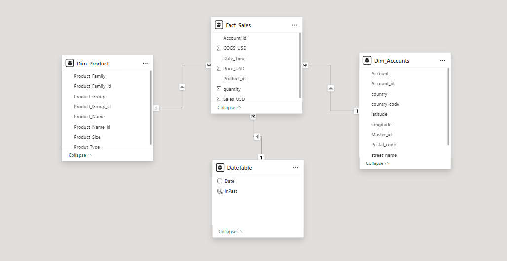
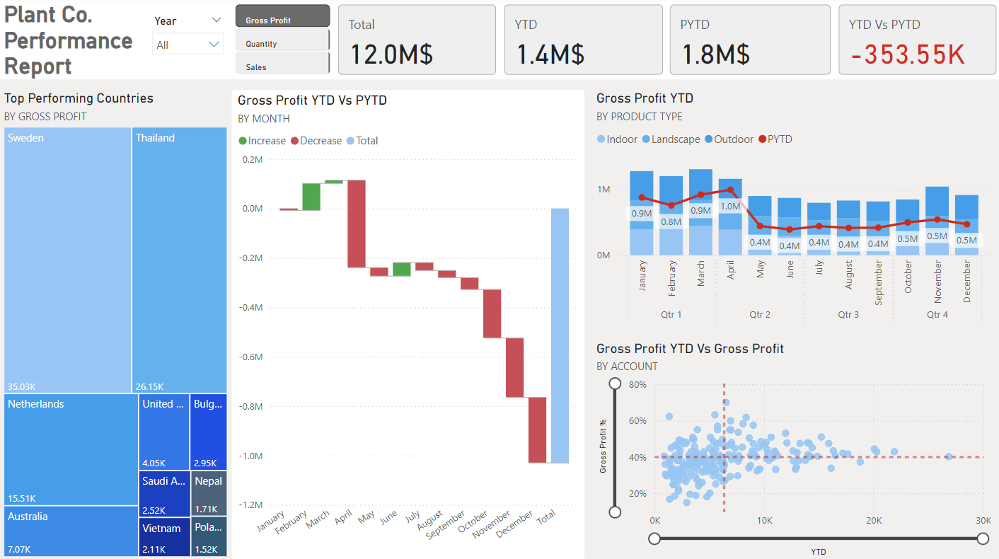

# Plant Co. Sales Performance Analysis

## Table of Contents
1. [Executive Summary](#executive-summary)
2. [Gross Profit](#gross-profit)
3. [Quantity Sold](#quantity-sold)
4. [Sales](#sales)
5. [Recommendations](#recommendations)

## Executive Summary
Plant Co. specializes in selling a variety of plant-based products, catering to a diverse global customer base. The company's revenue streams are driven by product sales across multiple regions, we analyze the key performance indicators including gross profit, quantity sold, and total sales to get detailed insights on the sales and profit trend of the company over the years. This report provides an indepth comparison of the Year-to-Date (YTD) performance against the Previous Year-to-Date (PYTD). It also offers insights into regional performance, product type contributions, and account profitability.

### Data Model Overview
- **Fact_Sales** - This table holds sales transactions over multiple years. Sales_USD and COGS_USD are used to calculate the profit margins.
- **Dim_Account** - Dimension table that stores customer account related information. It allows geographic analysis of sales using latitude and longitude.
- **Dim_Product** - Each record in this table provides a detailed information on the product heirarchy.
  

### Performance Report

Plant Co.'s performance report shows a decline across Gross Profit, Quantity, and Sales compared to the prior year. Gross Profit totals $12.0M, with YTD at $1.4M (down $353.55K from PYTD $1.8M). Quantity Sold is 1.24M units, with YTD at 148.47K (down 41.52K from PYTD 189.99K). Total Sales stand at $30.1M, with YTD at $3.6M (down $845.01K from PYTD $4.4M). Sweden, Thailand, and Poland are top-performing markets, while Indoor products contribute the most. Performance peaked in Q1, followed by a steady decline. Strategic focus on high-performing regions and product optimization is needed to recover lost growth.

## Gross Profit
- Total Gross Profit stands at $12.0M.
- YTD Gross Profit is $1.4M, reflecting a decline of $353.55K compared to PYTD $1.8M.
- The waterfall chart shows a significant decline in Gross Profit over time, particularly in the latter months. January and February had minor gains, but from March onwards, there was a consistent decrease. The largest drop occurred in the last quarter, emphasizing the need for intervention.
- Indoor products contribute the most to Gross Profit. Landscape and Outdoor products have lower contributions but follow a similar trend to Indoor products. Peak Gross Profit was observed in March ($1.0M), while the lowest occurred between July and November ($0.4M per month).
- Sweden ($35.03K) and Thailand ($26.15K) lead in Gross Profit. Some smaller markets like Bulgaria ($2.95K) and Vietnam ($2.11K) also contribute but at a lower scale.
- A scatter plot of Gross Profit % vs. YTD Gross Profit shows that most accounts have Gross Profit % below 40%, suggesting potential inefficiencies. Some high-value accounts have lower-than-expected Gross Profit %, which could indicate pricing or cost challenges.

### Key Observations
- Declining Trend: Q1 showed a peak in Gross Profit, but a steady decline followed from Q2 to Q4, highlighting revenue loss.
- Country Strategy: Sweden and Thailand are top performers, but focusing on underperforming regions may unlock new opportunities.
- Product Focus: Indoor products generate the most revenue, but optimizing Landscape and Outdoor product sales could diversify income streams.
- Account Profitability: A deep dive into accounts with low Gross Profit % could reveal pricing or cost inefficiencies to address.

## Quantity Sold
- The total quantity sold is 1.24M units, with the YTD quantity at 148.47K, showing a decline of 41.52K units compared to PYTD (189.99K units). This drop suggests a slowdown in sales volume, which could be attributed to lower demand, supply chain issues, or pricing strategies affecting sales.
- Poland (2.57K units) and Sweden (2.31K units) are the leaders in sales quantity.
- Indoor products remain the primary driver of sales, with a significant contribution. Landscape and Outdoor products also contribute but show a similar trend to Gross Profit, with peak sales in Q1 and a decline in later quarters.
- YTD quantity vs. Gross Profit % reveals that many low-margin products are among the highest-selling, which may indicate a trade-off between volume and profitability. A small number of high-margin products contribute significantly to overall profit, meaning price adjustments for high-volume, low-margin products could improve profitability.

### Key Observations
- Demand Fluctuations: The first quarter saw strong sales (especially in March), but a drop in Q2 suggests seasonal demand changes or supply issues.
- Geographic Focus: Poland and Sweden dominate in sales volume, while emerging markets like Saudi Arabia and the UK show growth potential.
- Profitability Optimization: Many high-volume products have low profit margins—adjusting pricing or reducing costs for these items could boost overall profitability.
- Recovery in H2: Sales quantity showed an upward trend after June, meaning strategies implemented mid-year may have started to yield results.

## Sales
- Plant Co. recorded a total sales revenue of $30.1M, with a YTD sales figure of $3.6M, reflecting a drop of $845K compared to the previous YTD ($4.4M).
- The monthly sales trend highlights strong performance in Q1 (January to April), peaking at $2.5M in April. However, May onwards shows a significant decline, stabilizing around $1M–$1.4M per month.
- Indoor product sales continue to dominate, with landscape and outdoor products showing similar sales patterns but lower revenue contributions.
- Thailand ($56.81K) and the Netherlands ($40.36K) lead in sales, making them the top-performing markets. Sweden ($34.58K) and Australia ($10.78K) follow, indicating solid demand but at a lower scale.
- The YTD vs. PYTD Waterfall Chart reveals major sales losses in Q2 and Q3, with minor gains in early Q1. This drop in sales significantly impacted overall profitability.
- The gross profit margin appears to hover below the 40% benchmark for a large number of accounts, indicating that even high sales figures may not necessarily translate into substantial profits.

### Key Observations
- Seasonal Impact on Sales: The first four months were strong, but revenue plummeted from May onward. Understanding whether this is due to external market factors, supply chain disruptions, or customer demand shifts is essential.
- Geographic Expansion Strategy: Markets like Nepal, Spain, and Saudi Arabia have untapped potential—targeted promotions or product bundling could help drive revenue growth.
- Profitability Optimization: A review of pricing strategies for high-revenue but low-margin products could improve gross profit without necessarily increasing sales volume.
- Sustained Revenue Growth Approach: Since Q4 shows slight improvement compared to mid-year, replicating successful Q4 strategies in the first half of the year could stabilize overall annual performance.

## Recommendations
- Strengthen marketing in high-performing regions while identifying growth opportunities in emerging markets.
- Strengthen sales in Q2 by addressing seasonal demand variations and improving supply chain efficiency.
- Adjust pricing strategy for high-volume, low-margin products to ensure better profit retention.
- Analyze Q3 recovery factors and replicate successful strategies across other markets and product categories.

#### While sales remain strong in key markets, a drop in YTD revenue and profitability concerns indicate a need for strategic adjustments in pricing, product mix, and regional market focus. Addressing these areas can enhance long-term growth and profitability for Plant Co.
