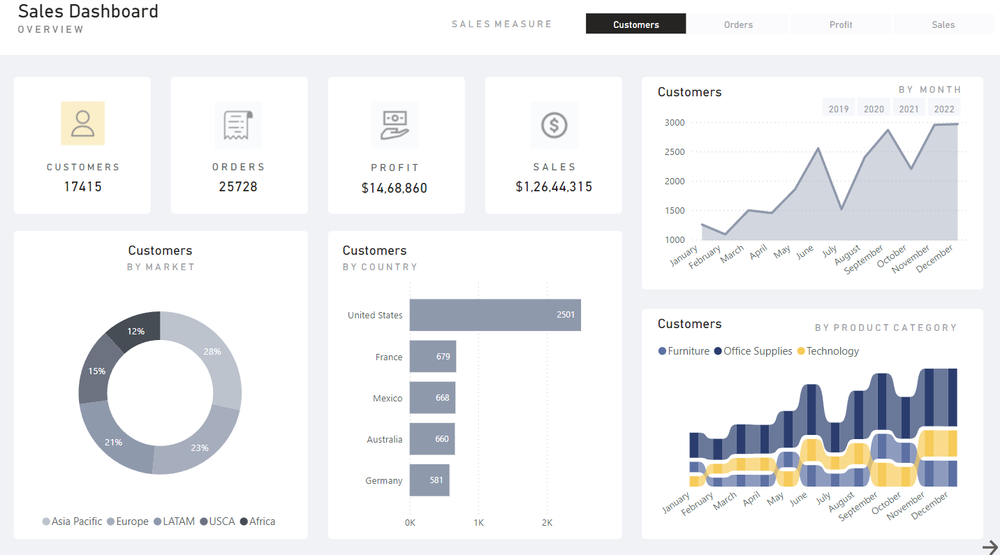

# WorkSpace Essentials Sales Analysis

## Table of Contents
1. [Executive Summary](#executive-summary)
2. [Customers Analysis](#customers-analysis)
3. [Orders Analysis](#orders-analysis)
4. [Profit Analysis](#profit-analysis)
5. [Sales Analysis](#sales-analysis)
6. [In-Depth Sales Analysis](#in-depth-sales-analysis)

## Executive Summary
WorkSpace Essentials is an e-commerce business dealing in Office Supplies, Furniture, and Technology products. This provides a comprehensive overview of key metrics: Customers, Orders, Profit, and Sales of the business. The data spans multiple years (2019-2022) and includes breakdowns by market, country, and product category. The analysis reveals trends in customer acquisition, order volume, profitability, and sales performance across different regions and product categories.

- **Total Sales**: $12,644,315, with sales trends showing fluctuations from 2019 to 2022. The highest sales are observed in the United States, contributing significantly to the overall revenue.
- **Total Profit**: $1,468,860, with the Technology category generating the highest profit ($563,994). The profit percentage of sales has remained stable, ranging between 10% and 13.5% from 2020 to 2022.
- **Total Customers**: 17,415, with the United States leading in customer count (2,501). Customer acquisition trends show growth or decline in specific periods from 2020 to 2022.
- **Total Orders**: 25,728, with the United States accounting for 49% of orders. Order volume trends indicate fluctuations over the years, with significant contributions from France, Australia, Mexico, and Germany.

This summary highlights the importance of the United States market and the Technology category in driving sales and profitability. The stable profit percentage indicates consistent financial performance, with opportunities to optimize profitability in underperforming regions and categories.

## Customers Analysis
- **Total Customers**: 17,415
- **Customers by Month**: The data shows customer acquisition trends from 2020 to 2022, indicating growth or decline in specific periods.
- **Customers by Market**: The distribution across markets is relatively balanced, with the highest percentage in one market (25%) and the lowest in another (13%).
- **Customers by Country**: The United States leads with 2,501 customers, followed by France (679), Mexico (668), Australia (660), and Germany (581).
- **Customers by Product Category**: The customer base is distributed across Furniture, Office Supplies, and Technology categories.

## Orders Analysis
- **Total Orders**: 25,728
- **Orders by Month**: The data indicates order volume trends from 2019 to 2022, showing fluctuations over the years.
- **Orders by Market**: The United States accounts for 49% of orders, with significant contributions from France (1,473), Australia (1,419), Mexico (1,522), and Germany (1,018).
- **Orders by Product Category**: Orders are distributed across Furniture, Office Supplies, and Technology, with potential insights into category popularity.

## Profit Analysis
- **Total Profit**: $1,468,860
- **Profit by Market**: The profit distribution across markets shows varying contributions, with some markets performing better than others.
- **Profit by Country**: The United States leads with $150,766.43, followed by China ($125,095.18), India ($111,597.27), and the United Kingdom ($109,119.79).
- **Profit by Month**: Profit trends from 2019 to 2022 indicate periods of growth or decline.
- **Profit by Product Category**: Technology generates the highest profit ($563,994), followed by Office Supplies ($536,607) and Furniture ($328,570).

## Sales Analysis
- **Total Sales**: $12,644,315
- **Sales by Market**: The United States dominates with 52.9% of sales, followed by Australia, France, China, and Germany.
- **Sales by Country**: The United States leads with significant sales, followed by Australia, France, China, and Germany.
- **Sales by Month**: Sales trends from 2019 to 2022 show fluctuations, with potential insights into seasonal patterns.
- **Sales by Product Category**: Sales are distributed across Furniture, Office Supplies, and Technology, with Technology likely being the top-performing category.

## In-Depth Sales Analysis
The second page of the dashboard focuses on **Profit % of Sales** and provides a detailed breakdown of profitability by product category and region.

- **Total Profit by Product Category**:
  - **Technology**: $563,994 (highest profit)
  - **Office Supplies**: $536,607
  - **Furniture**: $328,570 (lowest profit)

- **Profit % of Sales**:
  - The profit percentage has been relatively stable, ranging between 10% and 13.5% from 2020 to 2022.
  - The highest profit percentage was in 2020 (13.5%), with a slight decline in subsequent years.

- **Total Profit by Region**:
  - **Western Europe**: $216,607 (highest profit)
  - **Eastern Asia**: $167,175
  - **Southern Asia**: $159,417
  - **Central America**: $159,167
  - **Oceania**: $120,241 (lowest profit)

This page highlights the importance of the Technology category and Western Europe region in driving profitability. The stable profit percentage indicates consistent financial performance, with opportunities to optimize profitability in underperforming regions and categories.
